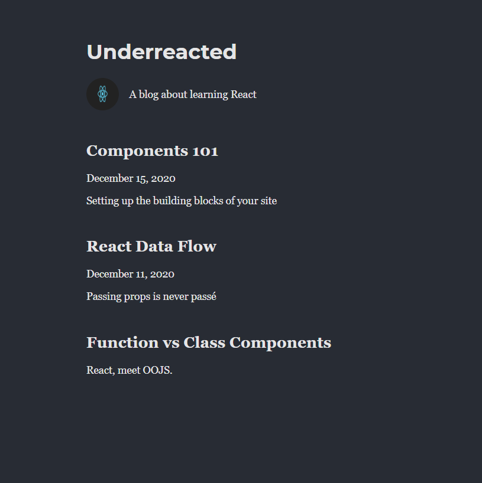

# Blog Site
This is a personal blog website on learning React. 
Presently it contains three posts: Components 101, React DataFlow and Function vs Class Components. 
Below is an image of the blogsite.


## How to Run the Project
1. Fork and clone the repository.
2. Open the project in VSCode.
3. Run the following commands:
   ```sh
   npm install
   npm run dev
   ```

## Component Tree 
```
└── App
    ├── Header
    ├── About
    └── ArticleList
        └── Article
```
The App component is the main parent component. Its children include Header, About, and ArticleList. The Article component is a child of ArticleList.


